# AI Pollinator Guardian

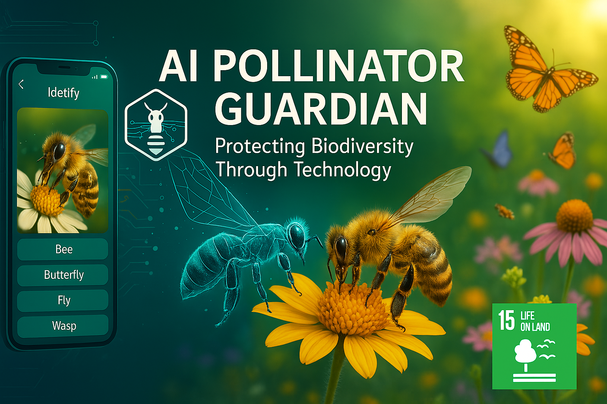
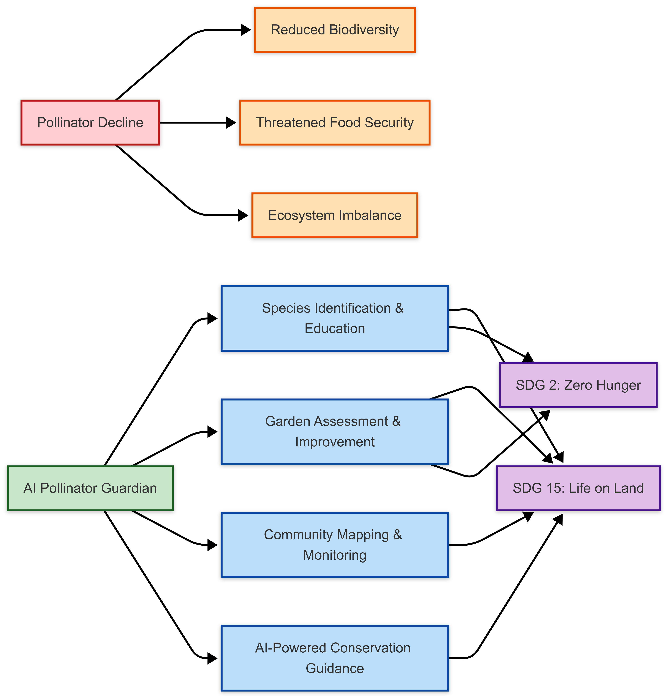

## 🐝 About The Project

AI Pollinator Guardian is a mobile application designed to address the critical decline of pollinator species worldwide through citizen science, AI-powered identification, and personalized garden recommendations. By leveraging Google's AI technologies and creating an accessible platform for pollinator conservation, we aim to make a meaningful impact on biodiversity protection and sustainable agriculture.

**Developed for KitaHack 2025** - Supporting UN Sustainable Development Goals 15 (Life on Land) and 2 (Zero Hunger).

## 📱 Demo

https://drive.google.com/file/d/1TlMw1m85kawP-lDxIbmdcaOFrbRoqy1s/view?usp=sharing

## ✨ Features

### Pollinator Identification
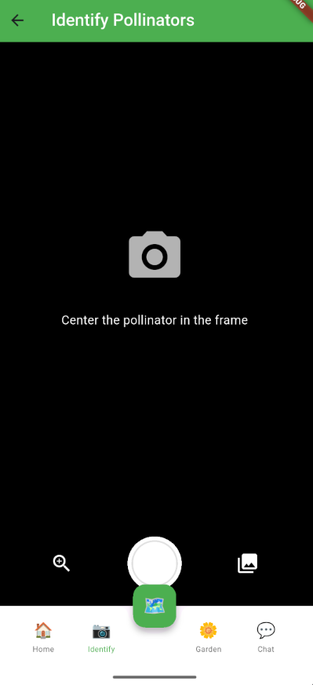
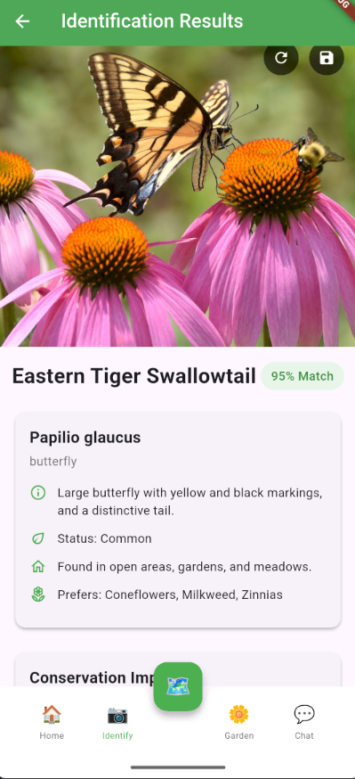

Identify pollinators using your device camera or gallery images. Our AI-powered system provides detailed information about the species, including:
- Common and scientific names
- Conservation status
- Habitat information
- Plant preferences
- Local population data

### Garden Scanner
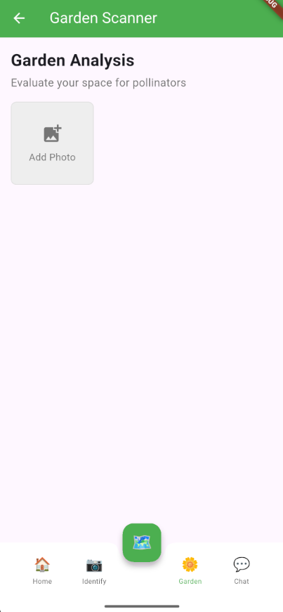
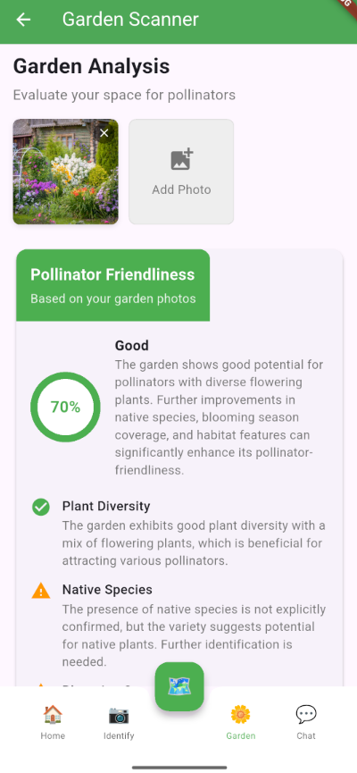

Analyze your garden's pollinator-friendliness and receive personalized recommendations:
- Garden assessment with pollinator support scoring
- Native plant recommendations tailored to your area
- Actionable improvement plan with progress tracking
- Visual indicators of garden health

### Community Map
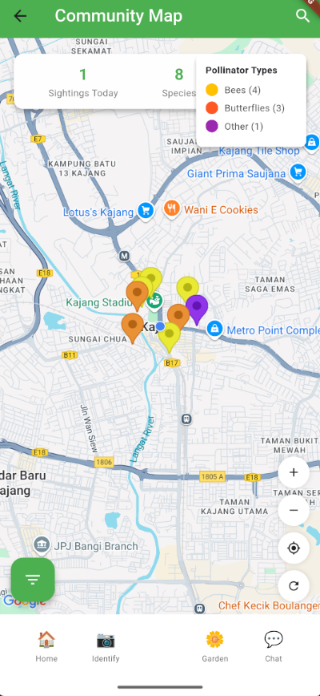

Explore and contribute to a community-driven map of pollinator sightings:
- Interactive map showing pollinator activity in your area
- Filters for species, time period, and location
- Detailed information on specific sightings
- Contribution to citizen science data collection

### AI Assistant
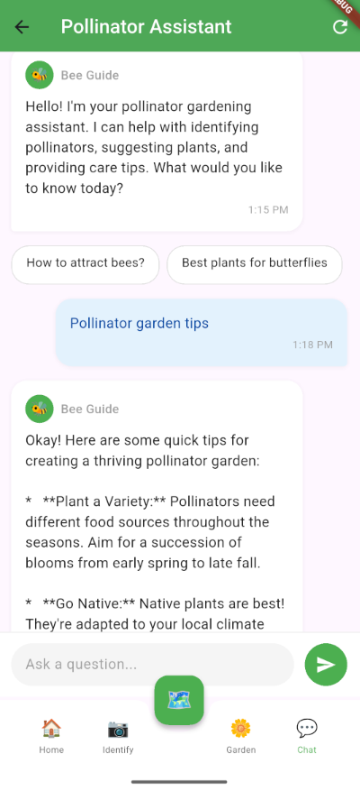

Get expert guidance on pollinator conservation with our AI-powered assistant:
- Personalized recommendations for your garden
- Educational content about pollinators
- Seasonal care tips and advice
- Contextual responses to your specific questions

### Home Dashboard
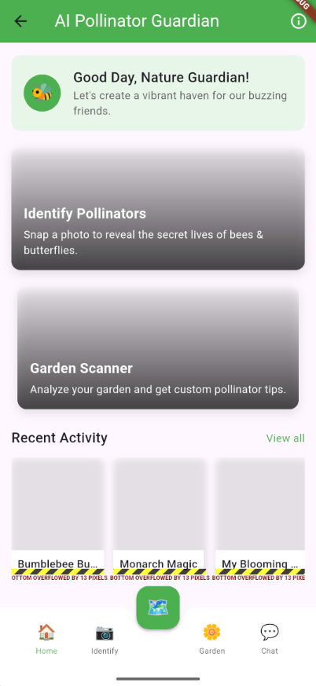

An intuitive entry point to all features with recent activity tracking and quick access to key functions.

## 🛠️ Architecture

Our application follows a modular feature-first architecture with clear separation of concerns:

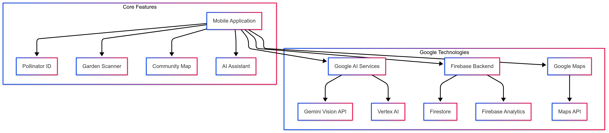

### User Journey Flow

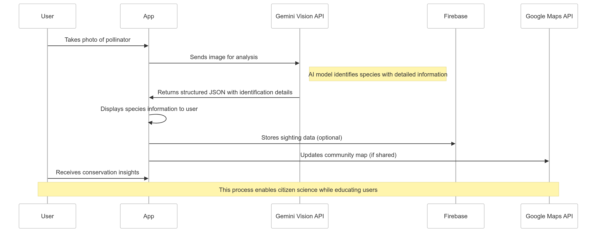

## 💻 Technologies Used

- **Frontend**: Flutter 3.7.2
- **State Management**: Provider 6.1.1
- **AI**: Google Gemini API via firebase_vertexai
- **Backend**: Firebase (Firestore, Storage, Analytics)
- **Mapping**: Google Maps API
- **Camera & Image Processing**: camera, image_picker, flutter_image_compress
- **Other Google Technologies**: Firebase Cloud Messaging, Firebase Analytics

## 🚀 Getting Started

### Prerequisites

- Flutter SDK (^3.7.2)
- Dart SDK (^3.0.0)
- Android Studio / VS Code
- Firebase project with enabled services (Authentication, Firestore, Storage)
- Google Maps API key
- Google Gemini API key

### Installation

1. Clone the repository
```bash
git clone https://github.com/stephen30ppp/AI-Pollinator-Guardian.git
cd ai_pollinator_guardian
```

2. Install dependencies
```bash
flutter pub get
```

3. Configure Firebase
   - Create a Firebase project
   - Add your Android & iOS apps to the project
   - Download and add the google-services.json and GoogleService-Info.plist files
   - Enable required Firebase services (Authentication, Firestore, Storage)

4. Configure your API keys
   - Create a .env file in the root directory
   - Add your API keys:
```
GOOGLE_MAPS_API_KEY=your_google_maps_api_key
GEMINI_API_KEY=your_gemini_api_key
```

5. Run the app
```bash
flutter run
```

## 📂 Project Structure

```
lib/
├── main.dart                 # App entry point
├── app.dart                  # App configuration and routing
├── constants/                # App-wide constants (colors, text styles, etc.)
├── utils/                    # Utility functions
├── models/                   # Data models shared across features
├── services/                 # Shared services (Firebase, Gemini API, etc.)
│   ├── firebase_service.dart # Firebase interactions
│   ├── gemini_service.dart   # Gemini API service
│   ├── location_service.dart # Location services
│   └── storage_service.dart  # Storage for images, etc.
├── features/                 # Core features organized by functionality
│   ├── authentication/       # User authentication screens
│   ├── home/                 # Home screen of the app
│   ├── pollinator_id/        # Pollinator identification feature
│   ├── garden_scanner/       # Garden scanner feature
│   ├── community_map/        # Community map feature
│   └── chat_assistant/       # Chat assistant feature
└── widgets/                  # Shared widgets used across features
```

## 👥 Team

- **[Xu Yanguo]** - Lead Developer
- **[Fang Zhili]** - UI/UX Designer
- **[Adith Reshav Mohan]** - Backend Developer
- **[Shum Joan]** - AI Integration Specialist

## 📊 Future Roadmap

- User authentication and profiles
- Offline mode with on-device ML models
- Gamification features (badges, challenges)
- Advanced community features (local conservation initiatives)
- Weather API integration for seasonal advice
- Educational content for schools and community groups

## 🙏 Acknowledgments

- Google Developer Groups on Campus Malaysia for organizing KitaHack 2025
- Flutter and Firebase communities for their excellent documentation
- All beta testers who provided valuable feedback during development

## 📄 License

This project is licensed under the MIT License - see the [LICENSE](LICENSE) file for details.

---

<p align="center">
  <i>Built with 💚 for the planet's pollinators</i>
</p>