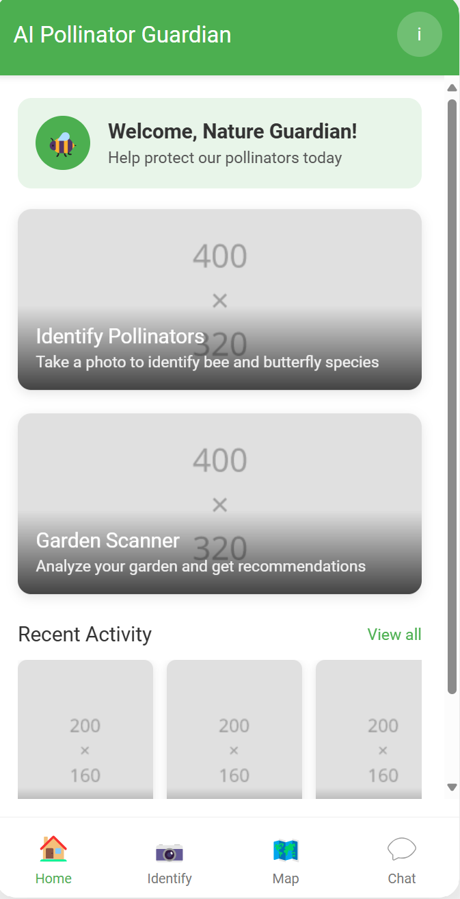
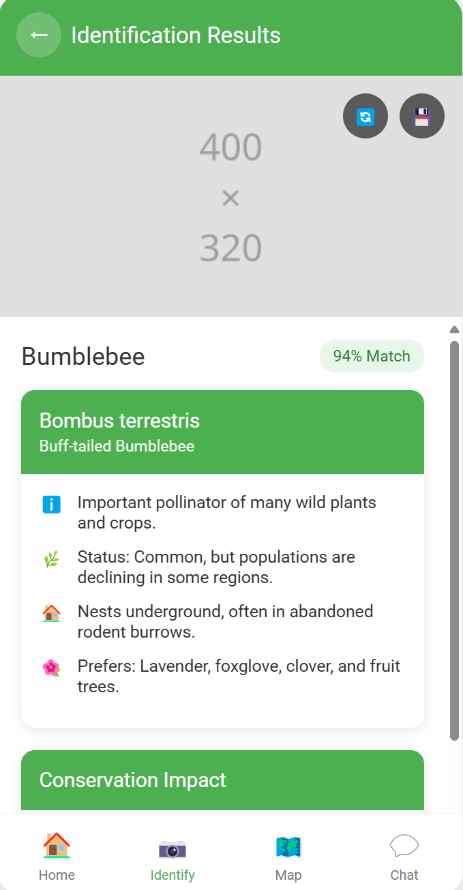
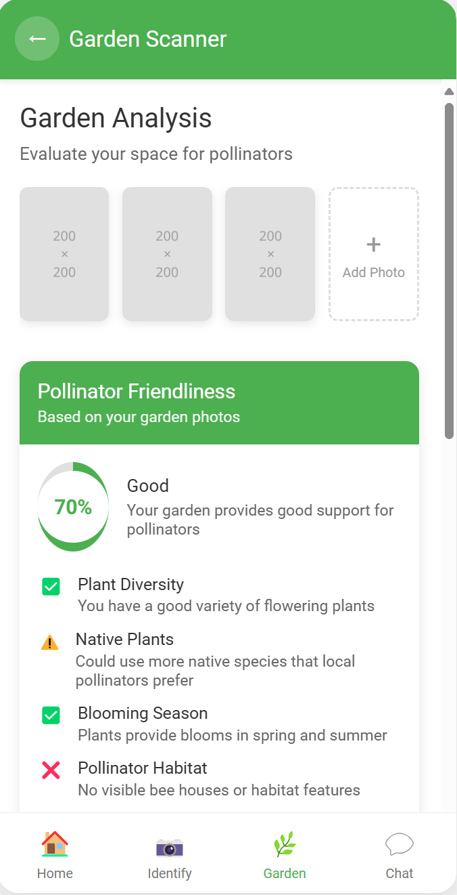
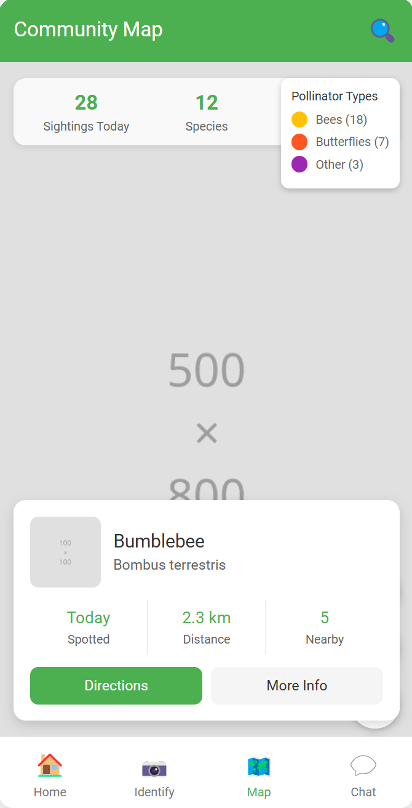
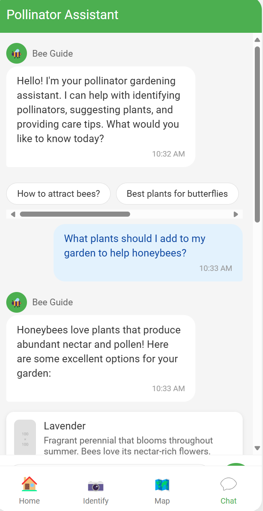

# AI Pollinator Guardian

## Project Overview

AI Pollinator Guardian is a mobile application designed to address the critical decline of pollinator species worldwide. Built for the KitaHack 2025 Hackathon, this app leverages artificial intelligence to help citizens identify pollinators, create pollinator-friendly environments, and contribute to a global database of pollinator sightings.

### Environmental Problem Addressed

Pollinator decline threatens food crops and ecosystems worldwide. Approximately 75% of global food crops and 87% ([Brunet, J., & Fragoso, F. P. 2024](https://www.cabidigitallibrary.org/doi/10.1079/cabireviews.2024.0016#:~:text=What%20are%20the%20main%20reasons,on%20pollinators%20for%20seed), [Carrington, D. 2023, January 9](https://www.theguardian.com/environment/2023/jan/09/global-pollinator-losses-causing-500000-early-deaths-a-year-study#:~:text=Three,pollinator%20loss%2C%20the%20scientists%20said)) of flowering plants depend on animal pollinators. However, many pollinator species (bees, butterflies, etc.) are in sharp decline due to habitat loss, pesticides, and climate change – endangering biodiversity and crop yields.

### UN Sustainable Development Goals

This project directly supports:
- **SDG 15: Life on Land** - By conserving biodiversity through pollinator protection
- **SDG 2: Zero Hunger** - By safeguarding crop pollination essential for food security

## App Prototype

Our app prototype consists of five key screens that demonstrate the core functionality of the AI Pollinator Guardian. Below is an overview of each screen:

### 1. Home Screen

The Home Screen serves as the central hub of the application, featuring:
- Personalized welcome message to engage users in pollinator conservation
- Quick access cards to primary features (identification and garden scanning)
- Recent activity section showing the user's latest interactions with pollinators
- Bottom navigation for easy access to all app sections

**Prototype:** [View Home Screen](prototype/home_screen.html)

### 2. Pollinator Identification Screen

The Identification Screen showcases our AI-powered insect recognition:
- High-confidence species identification with image preview
- Detailed information including scientific name and conservation status
- Ecological facts about the identified pollinator
- Conservation impact metrics showing community contributions
- Options to save sightings to the global database

**Prototype:** [View Identification Screen](prototype/identification_screen.html)

### 3. Garden Scanner

The Garden Scanner leverages AI to analyze and improve pollinator habitats:
- Multi-image garden scanning capability
- Pollinator-friendliness score with detailed analysis
- Personalized plant recommendations based on AI analysis
- Actionable pollinator plan with progress tracking
- Guidance for creating better pollinator habitats

**Prototype:** [View Garden Scanner](prototype/garden_scanner.html)

### 4. Community Map

The Community Map visualizes the citizen science aspect of the app:
- Interactive map showing pollinator sightings in the user's area
- Filtering options for species type, date range, and search radius
- Statistics on local pollinator activity
- Detailed information on specific sightings
- Contribution to scientific research through data visualization

**Prototype:** [View Community Map](prototype/community_map.html)

### 5. AI Chatbot Assistant

The AI Chatbot provides personalized guidance on pollinator conservation:
- Natural language conversation about pollinator care
- Suggestion chips for common pollinator gardening questions
- Rich responses including plant recommendations with images
- Educational resources for deeper learning
- Contextual advice based on user's location and garden profile

**Prototype:** [View Chatbot Assistant](prototype/chatbot.html)

## Key Features

1. **AI-Powered Pollinator Identification**
   - On-device machine learning for real-time insect identification
   - Detailed species information and conservation status
   - Contribution to global pollinator database

2. **Garden Analysis & Recommendations**
   - AI assessment of garden pollinator-friendliness
   - Personalized native plant recommendations
   - Actionable improvement plan

3. **Community Pollinator Mapping**
   - Visualization of user-submitted pollinator sightings
   - Data filtering and trend analysis
   - Contribution to conservation research

4. **Pollinator Care Assistant**
   - AI chatbot for personalized gardening advice
   - Educational content on pollinator conservation
   - Seasonal notifications and care tips

## Technology Stack

- **Frontend**: Flutter (Dart)
- **Backend**: Firebase (Authentication, Firestore, Storage)
- **AI/ML**: TensorFlow Lite, Google Cloud AutoML Vision
- **APIs**: Google Maps, Dialogflow, Google Translate

### Google Technologies Used

- **TensorFlow Lite**: On-device pollinator identification
- **Google Cloud AutoML Vision**: Custom model training for pollinator recognition
- **Firebase**: Data storage and synchronization
- **Google Maps API**: Visualization of pollinator sightings
- **Gemini**: Interactive chatbot for pollinator care

## Impact & Scalability

AI Pollinator Guardian creates impact through:

1. **Citizen Science**: Enabling non-experts to contribute valuable data on pollinator populations
2. **Behavior Change**: Encouraging creation of pollinator-friendly habitats
3. **Community Engagement**: Building a network of pollinator guardians
4. **Educational Value**: Teaching about biodiversity and ecosystem services
5. **Research Support**: Providing data for conservation scientists

The solution is designed to scale globally, with:
- Multi-language support for wide accessibility
- Region-specific plant recommendations
- Offline functionality for use in areas with limited connectivity
- Low computational requirements for diverse device compatibility